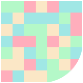

  

# open flood for SFOS

This is an open flood game implementation, inspired and with bits from [gunship_penguin](https://github.com/GunshipPenguin/open_flood).

This game is mainly a tech demo of [sailing-to-coffee](https://github.com/thigg/sailing-to-coffee).
Thus it tries to explore how usable native compiled shared java libraries are for SailfishOS applications.

The fieldsize has been increased to 250x250 for fun, and to show performance

## Implementation notices
The java part serializes the game state with flatbuffers to transmit less data and sends it to the c++ part.
The flatbuffer definition is in `java-part/src/main/resources`.
It can be updated with the script in [java-part/flatbuffers.sh](java-part/flatbuffers.sh) (make sure, that the installed version of flatc matches the header files in `qt-part/lib`.

For performance reasons, the gamestate is directly parsed in c++ and the gamepanel is drawn from c++ as well.

## Future Plans / Ideas

### Technical
 - Save scores with sqlite

### Gameplay
 - Count scores
   - [x] combo size score
   - least moves
   - most moves with always progressing
   - ... inspire people to be creative
 - Different field patterns with blocks
 - [x] 2 Player mode
 - Play against bots (and maybe let people submit bots to get them engaged)
 - Inspire people to do stupid stuff by manipulating the gamefield, e.g. display videos
 - Music?
 - Color schemes?
 - Levels?
 - field tiles that are harder to transform. e.g. switch color on first break

## Building
### Prerequisites
You'll need graalvm working on your phone. See [sailing-to-coffee](https://github.com/thigg/sailing-to-coffee) for further instructions.

1. run `git submodule init` in this repo
1. install  `pkcon install gcc glibc-devel zlib-devel libstdc++-static` to your aarch64 phone
2. download graalvm to your phone

### Building

The java part needs to be built first. Adjust the [compile.sh script](java-part/compile.sh) to your needs.
You'll need the prequesits (graal native) on your phone. Cross compilation is not yet possible with graal native.

Afterwards build the qt part with the sailfish ide. This links with the java part.

See [sailing-to-coffee](https://github.com/thigg/sailing-to-coffee) for further instructions.
The concrete implementation differs quite a lot, see implementation notes above for that.

## Credits
 - development by me, Thilo Kogge
 - logo by miehl
 - original game by Rhys Rustad-Elliott (GunshipPenguin)
 - flypig build testing

## License
With exceptions this project is public domain. Thus you can do with it whatever you want.
The exceptions are:
 - the original implementation of the game engine (Game.java) by Rhys Rustad-Elliott (MIT licensed)
